<!-- _class: -->

hacking your tools/brain
for profit

---
h4x1ng your tools/brain
for `l33t cred`

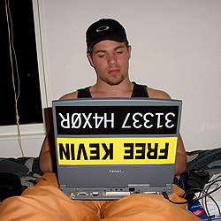

---

## this is for you.
Interrupt as often as you like.
Heckle as necessary.

---
## why are we here?

---
> Hell is other people.

---
> Hell is watching ~~Shankar~~ other people use the shell.

<!--
- Satre is often misquoted ...
- i do feel bad picking on the lad when he's out on vacay and can't defend himself.
-->

---

<!--
- We're here to talk about our everyday tools!
-->

---

<!--
- Tools shape the way we think.
-->
---
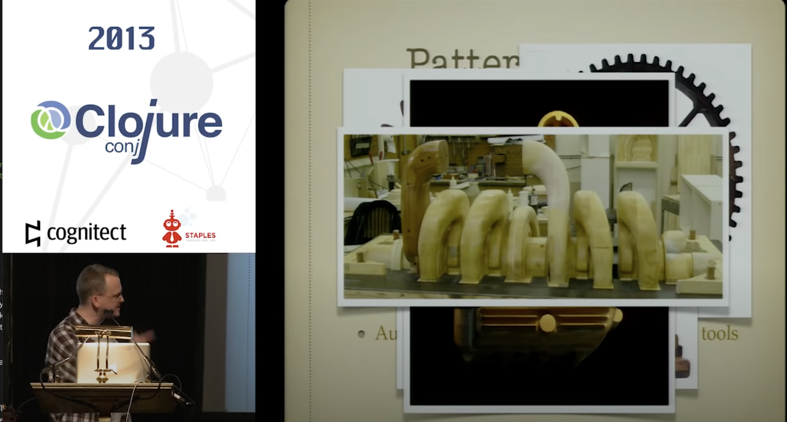
[Programming with Hand Tools - Tim Ewald](https://www.youtube.com/watch?v=ShEez0JkOFw)

---
## disclaimers

---

<!--
- _MY_ current opinions. They could be completely wrong for you;
- I promise you, I’ll change my mind as I learn more.
-->

---

no single right answer.  
plenty of wrong ones tho.

---
$$ \lim_{non-tech-shit\to0} $$

<!--
im going to try to keep non-tech shit low, but i make no promises
-->

---
## tbh tho

---

i want it ~~that~~ my way.

<!--
raise your hands if you got this reference
-->

---
if it wasn't clear, this is going to be a weird mix of dated pop-culture, philosophy, and t3ch h4cks.
strap in.

---

begin at the beginning

<!--
where do we start?
-->

---
<!-- _class: -->

step 0. reproducibility

<!---
p.s. as everyone knows we start counting at 0.
-->

---
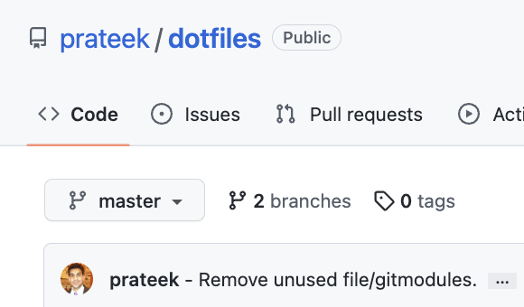
make a dotfiles repo

<!--
- put all your shit - rc files/app configs/etc in there.
- my dropbox app config folder needs to be migrated. sigh XDG_HOME_DIR ...
-->

---
## brief tangent
where does the term `rc` file come from?

---
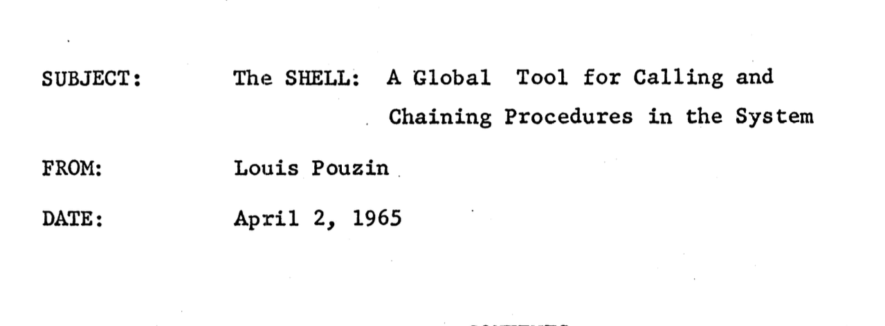
`RUNCOM` files
CTSS: Compatible Time-Sharing System

---
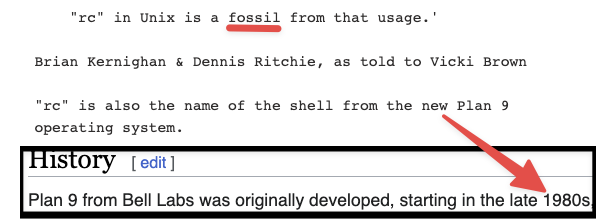

---
## back to your dotfiles
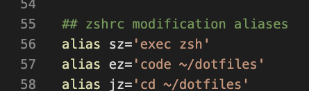
"gardening"

---
<!-- _class: -->
step 1. notes & gtd

---
human brains hold 4-7 thoughts.
optimize for that.

---
### note talking
1. idc what you use. i care that you use something.
2. i optimize for access + linkage + portability.
	 you might optimize for something else.

---
### my setup

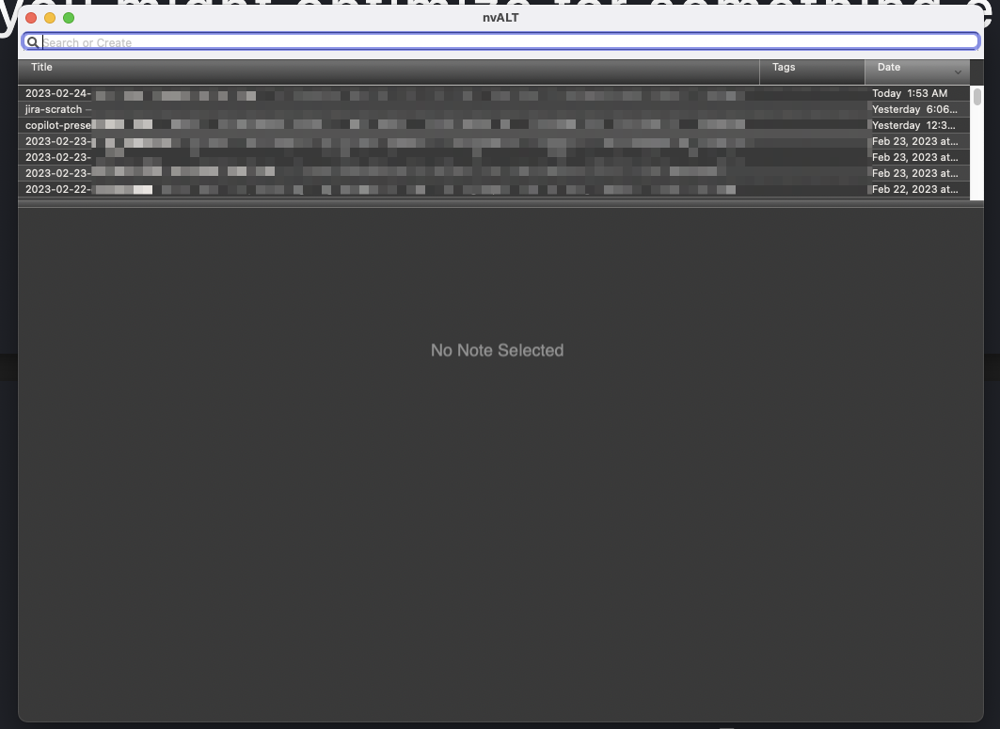
[nvALT](https://brettterpstra.com/projects/nvalt/) on my Mac. [colorscheme](https://rocketink.net/2013/01/my-nvalt-setup.html).
[sync-ed](http://writeapp.net/write+nvalt.html) via Dropbox.
[1Writer](https://1writerapp.com/) on my iPhone.

<!--
- Ease of access - single hotkey to find/create notes.
- Ease of access - notes available everywhere i am.
- Linkage - linking thoughts.
- Portability: plain markdown. anecdote about extracting notes from sqlite.db underlying OSX notes in 2007.
-->

---
### demo

---

---
`note talking != todos`

<!--
i personally oscillate between [Things](https://culturedcode.com/things/) and [Omnifocus](https://www.omnigroup.com/omnifocus) every year or two.
-->

---
for now, repeat after me

> only actionable items in my todo thingy.

---

`we should all read this`

---
<!-- _class: -->

step 2. terminal + shell

---

pop-quiz
why are terminals today called terminal emulators?

---

my vote: [iTerm2](https://iterm2.com/features.html) + [zsh](https://zsh.sourceforge.io/)
or: *sh && [tmux](https://github.com/tmux/tmux/wiki/Getting-Started) && ([kitty](https://sw.kovidgoyal.net/kitty/) || [alacritty](https://github.com/alacritty/alacritty))

whatever you do, \

<!--
# Why iTerm2?
- Smooth scrolling!
- Themes
- Panes
- Mouseless copy/paste
- Usable search
- All kinds of integrations (more on this later.)
-->

---
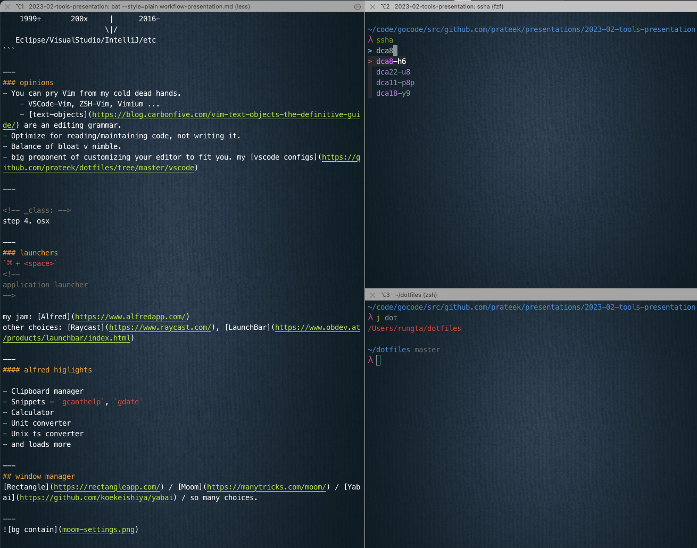

---
my barebones checklist:
- [ ] configure TERM. my jam - [Solarized Dracula](https://github.com/mbadolato/iTerm2-Color-Schemes#solarized-darcula-with-background-image)
- [ ] pick a [prompt](https://sweetcode.io/getting-started-with-zsh-for-macos/) that works for you, I adapted [pure](https://github.com/sindresorhus/pure)
- [ ] add sensible defaults for [history](https://github.com/prateek/dotfiles/blob/master/zsh/lib/history.zsh)
- [ ] install [fzf](https://github.com/junegunn/fzf), [configure](https://github.com/prateek/dotfiles/blob/master/zsh/extra/fzf.zsh#L38-L46) it to your liking.
- [ ] create aliases that work for you - my [git](https://github.com/prateek/dotfiles/blob/master/zsh/lib/alias.zsh#L5-L17), [uber](https://github.com/prateek/dotfiles/blob/master/zsh/lib/uber.zsh)

<!--
- talk about the state inference afforded by a good prompt.
- make your tools fit your mental model / workflow.
- i've been a zsh-stan for ~12y now, but even still;
  vast majority of my scripts are posix compatible.
- quick demo of some fun things:
  - iterm2 panes + navigation
	- ssha
	- wsa
-->

---
<!-- _class: -->
step 3. code editor

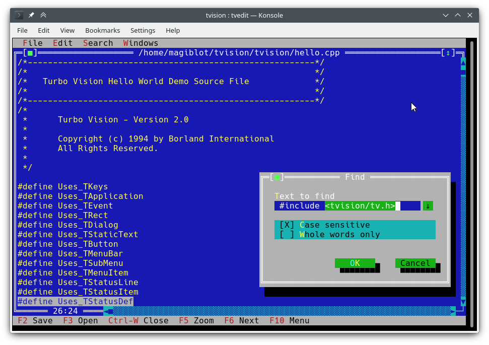

---

Optimize for reading, not writing code.

---

### opinions
- make your editor fit you. my [.vscode/](https://github.com/prateek/dotfiles/tree/master/vscode)
- You can pry Vim from my cold dead hands.
	- VSCode-Vim, ZSH-Vim, Vimium ...
	- [text-objects](https://blog.carbonfive.com/vim-text-objects-the-definitive-guide/) are an editing grammar.
- Balance of bloat v nimble.

---

<!-- _class: -->
step 4. osx

---
### launchers
`⌘ + <space>`
<!--
application launcher
-->

my jam: [Alfred](https://www.alfredapp.com/)
other choices: [Raycast](https://www.raycast.com/), [LaunchBar](https://www.obdev.at/products/launchbar/index.html)

---
#### alfred higlights

- Clipboard manager
- Snippets - `gcanthelp`, `gdate`
- Calculator
- Unit converter
- Unix ts converter
- and loads more

---
## window manager
[Rectangle](https://rectangleapp.com/) / [Moom](https://manytricks.com/moom/) / [Yabai](https://github.com/koekeishiya/yabai) / so many choices.

---
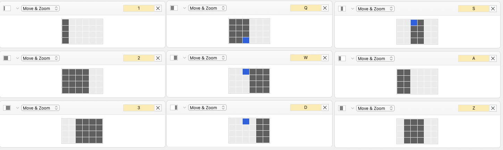

---
## keyboard shortcuts
[Karabiner](https://karabiner-elements.pqrs.org/) / [KMonad](https://github.com/kmonad/kmonad) / [Via](https://www.caniusevia.com/)
[BetterTouchTool](https://folivora.ai/)

---
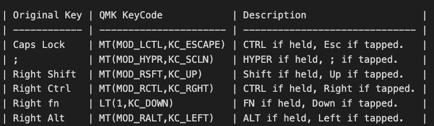
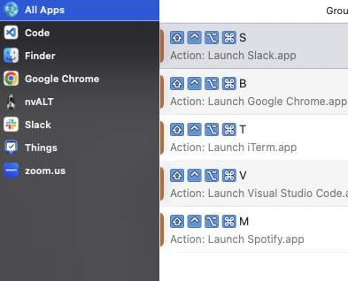

---
### cautionary tale
- Karabiner borked when I was taking screenshots this weekend. ~1.5h learning QMK and migrating to that.
  I have many, many tales like this.
- Persistence is both a virtue, and a weakness.

<!--
 - learning when to stop running into walls is “wisdom”
-->

---

https://xkcd.com/1205/

---
## takeaways

---
~~We should all blame Shankar.~~

---
please, "steal"
the journey is the prize
“it’s just code” is a mindset
a bite at a time

<!--
- This was a just a bunch of shit that kinda works for me. find tools that work for *_you_*.
- Invest in yourself.
	- How do you learn habits. Pickup one, at most two things at a time. See if you like em. And iterate.
	- My shit you’re seeing here is the result of 15y of accumulation (fuck, I’m old…).
-->

---
### external references
- https://github.com/topics/awesome
- Brett Terpstra - [Blog](https://brettterpstra.com/)
- David Sparks - [Blog](https://www.macsparky.com/), [Podcast](https://www.relay.fm/mpu)

### internal references
- Denis Isidoro - [Raycast Extension for Uber](https://engwiki.uberinternal.com/display/~denis.isidoro@uber.com/Raycast+extension)
- Payment Platform's [worklow](https://engwiki.uberinternal.com/display/TE0PAYMENTEFF/Workflow+Optimization) suggestions
- Order Platform's [soliloquy](https://engwiki.uberinternal.com/display/TE0ORDERPLAT/4.+Life%2C+the+Universe+and+Everything)
- [My dotfiles](github.com/prateek/dotfiles)
